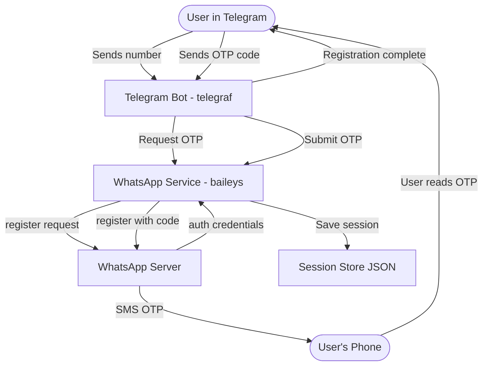
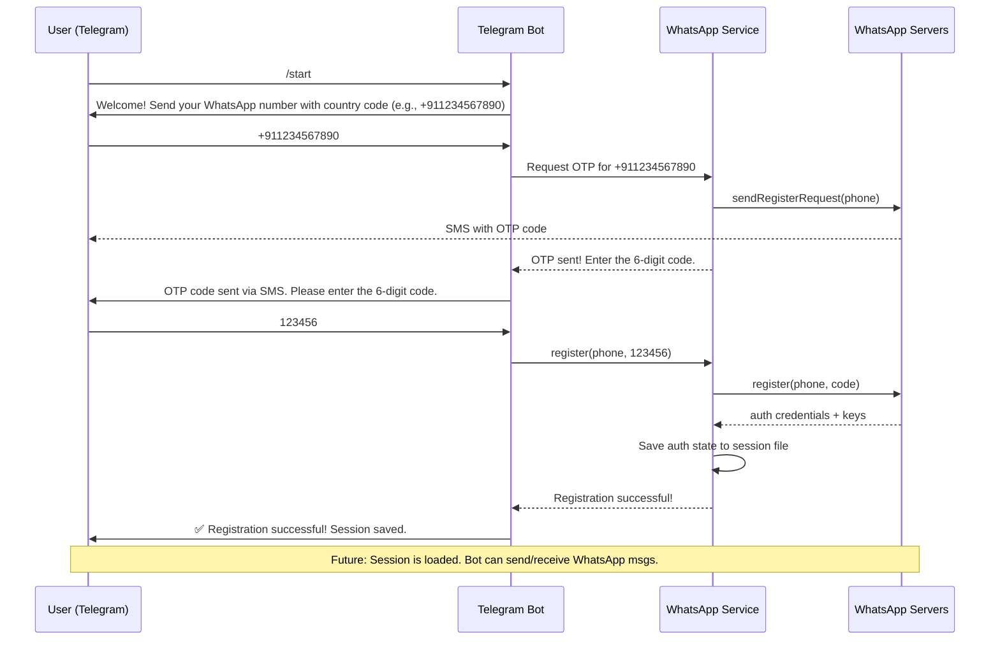

# Telegram → WhatsApp Registration Bot — Architecture Plan

## 1. Overview

A Telegram bot that allows a user to register a new WhatsApp number programmatically. The bot:
1. Asks for a phone number (with country code)
2. Requests OTP from WhatsApp
3. User submits the OTP code
4. Bot completes registration and persists the session
5. Session remains active for future messaging

## 2. Tech Stack

| Component | Technology | Purpose |
|---|---|---|
| Runtime | Node.js 18+ | Cross-platform, async I/O |
| Telegram Bot | [`telegraf`](https://github.com/telegraf/telegraf) | Modern, well-maintained Telegram bot framework |
| WhatsApp Protocol | [`@whiskeysockets/baileys`](https://github.com/WhiskeySockets/Baileys) | Unofficial WhatsApp Multi-Device protocol implementation |
| QR/Link Codec | [`qrcode-terminal`](https://github.com/gtanner/qrcode-terminal) | Display pairing QR in terminal |
| State Persistence | JSON file-based store | Baileys auth state + registered phone storage |
| Environment Config | [`dotenv`](https://github.com/motdotla/dotenv) | Load `.env` variables |
| Node ID Lib | [`uuid`](https://github.com/uuidjs/uuid) | Generate unique request IDs |

## 3. System Architecture



## 4. Conversation Flow



## 5. File Structure

```
c:/Users/Abhix/Desktop/TgWhatsapp/
├── .env                    # BOT_TOKEN, other secrets (NOT committed)
├── .env.example            # Template for .env
├── .gitignore              # Ignore node_modules, .env, auth_state/
├── package.json
├── README.md
├── src/
│   ├── index.js            # Entry point → initializes bot + WhatsApp service
│   ├── config.js           # Loads .env and exports config object
│   ├── telegram/
│   │   └── bot.js          # Telegraf setup, command handlers, conversations
│   └── whatsapp/
│       ├── service.js      # WhatsApp registration logic + session management
│       └── chat-handler.js # (Optional) Handle incoming WhatsApp messages
└── auth_state/             # Generated at runtime — contains session creds
    └── <phone>/            # Per-number auth state folder
```

## 6. Detailed Module Design

### 6.1 `config.js`
- Loads `.env` via `dotenv`
- Exports: `TELEGRAM_BOT_TOKEN`, `PORT` (optional)

### 6.2 `src/whatsapp/service.js`
Key responsibilities:
- **`registerPhone(phoneNumber, otpCode)`** — Core function
  1. Create a fresh Baileys `makeWASocket` with ephemeral auth (no stored creds yet)
  2. Call `sock.register(phoneNumber, token)` where `token` is the OTP code
  3. On success: extract creds via `useMultiFileAuthState()` and save to `auth_state/<phone>/`
  4. Return success/failure
- **`requestOTP(phoneNumber)`** — Trigger OTP send
  1. Create ephemeral socket
  2. Call `sock.requestRegisterCode(phoneNumber, method='sms')`
  3. Return success or error
- **`getSocketForPhone(phoneNumber)`** — Load existing session for messaging
  1. Load auth state from `auth_state/<phone>/`
  2. Return a connected `makeWASocket`
- **Session tracking:** Maintain a JSON map of registered phone numbers

### 6.3 `src/telegram/bot.js`
Commands:
| Command | Handler |
|---|---|
| `/start` | Show welcome message with instructions |
| `/register` | Start registration flow (this is the main flow) |
| `/list` | Show registered WhatsApp numbers |
| `/send` | Send a WhatsApp message from a registered number (bonus) |

Conversation flow (using Telegraf `session` + `composer`):
1. `/register` → bot asks for phone number
2. User sends number → bot calls `WhatsAppService.requestOTP()`
3. Bot confirms OTP sent → asks for 6-digit code
4. User sends code → bot calls `WhatsAppService.registerPhone()`
5. Bot reports success/failure

State management: Use Telegraf's built-in session (`session()` middleware)

### 6.4 `src/index.js`
- Initialize config
- Initialize auth state directories
- Start the WhatsApp service (pre-load any existing sessions)
- Start the Telegram bot
- Graceful shutdown (SIGINT/SIGTERM → disconnect sockets, save state)

## 7. Data Flow — Registration

```
Step 1: User sends /register
Step 2: Bot: "Send your WhatsApp number with country code"
Step 3: User: "+911234567890"
Step 4: Bot → service.requestOTP("911234567890")
         → Baileys creates ephemeral socket
         → sock.requestRegisterCode("911234567890", "sms")
         → WhatsApp sends SMS OTP
Step 5: Bot: "OTP sent via SMS. Enter the 6-digit code:"
Step 6: User: "482391"
Step 7: Bot → service.registerPhone("911234567890", "482391")
         → Baileys creates new ephemeral socket
         → sock.register("911234567890", "482391")
         → On success: save auth_state/<phone>/
         → Save phone to registered phones list
Step 8: Bot: "✅ Registration successful! Your WhatsApp number is now active."
```

## 8. Security Considerations

- **Number blocking risk:** WhatsApp may ban numbers registered via unofficial methods. Use secondary/test numbers only.
- **`.env` file:** Never commit. Contains the Telegram bot token.
- **`auth_state/`:** Never commit. Contains WhatsApp session credentials.
- **Rate limiting:** WhatsApp may rate-limit OTP requests. Implement a minimum 60s cooldown between attempts per number.
- **User input validation:** Validate phone numbers match expected format (`+[country][number]`), OTP is exactly 6 digits.

## 9. Setup Instructions (End User)

1. Create a Telegram bot via [@BotFather](https://t.me/BotFather) and get the token
2. Clone the repo
3. Run `npm install`
4. Copy `.env.example` to `.env` and fill in `TELEGRAM_BOT_TOKEN`
5. Run `npm start`
6. Open Telegram and message the bot `/register`

## 10. Environment Variables

```
TELEGRAM_BOT_TOKEN=your_token_here
# Optional:
PORT=3000
```

## 11. Dependencies

```json
{
  "dependencies": {
    "@whiskeysockets/baileys": "^6.7.0",
    "telegraf": "^4.16.0",
    "dotenv": "^16.4.0",
    "qrcode-terminal": "^0.12.0",
    "uuid": "^9.0.0"
  }
}
```

## 12. Potential Challenges & Mitigations

| Challenge | Mitigation |
|---|---|
| WhatsApp blocks registration | Use secondary number; add retry logic with delays |
| OTP not received | Support voice call fallback (`method='voice'`) |
| Session corruption | Handle errors gracefully; allow re-registration |
| Telegram API rate limits | Telegraf handles retries automatically |
| Node.js version compatibility | Target Node 18+; document requirement |